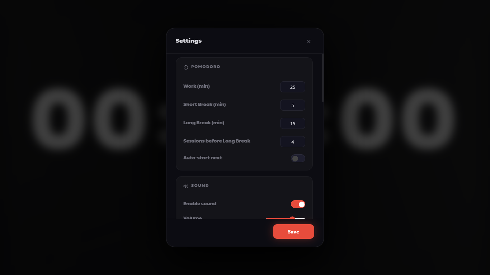
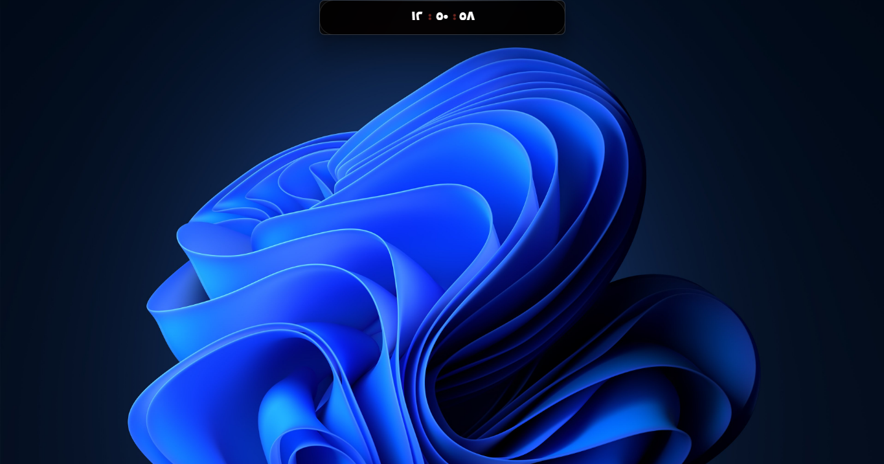

# VibaTime

> VibaTime — a premium iOS-style StandBy clock with Pomodoro timer, tasks, and SoundCloud music player for deep work

[](https://pptr.dev/)
[](https://nodejs.org/)
[](LICENSE)
[]()
[]()

**Developer:** abusn

---

## Screenshots

<!-- Place your screenshot here: Main screen in Clock Mode -->
> Screenshot 1 — Main screen in Clock Mode (StandBy)


---

<!-- Place your screenshot here: Pomodoro mode -->
> Screenshot 2 — Pomodoro Timer Mode


---

<!-- Place your screenshot here: Tasks panel -->
> Screenshot 3 — Tasks Panel (right side)


---

<!-- Place your screenshot here: Music player -->
> Screenshot 4 — SoundCloud Music Player (left side)


---

<!-- Place your screenshot here: Settings window -->
> Screenshot 5 — Settings Window



---

<!-- Place your screenshot here: Dynamic Island mode -->
> Screenshot 6 — Dynamic Island Mode (mini clock)



---

<!-- Place your screenshot here: Counter setup -->
> Screenshot 7 — Counter Setup (Countdown / Count Up)


---

## Table of Contents

- [Features](#features)
- [Installation](#installation)
- [Project Structure](#project-structure)
- [Usage](#usage)
- [Modes](#modes)
- [Settings](#settings)
- [Tasks](#tasks)
- [Music Player](#music-player)
- [Language Support](#language-support)
- [Custom Fonts](#custom-fonts)
- [Building](#building)
- [Tech Stack](#tech-stack)

---

## Features

| Feature | Description |
|---------|-------------|
| StandBy Clock | Large iOS-style StandBy clock with date and local time widgets |
| Pomodoro | Full Pomodoro timer with work / short break / long break cycles |
| Counter | Configurable countdown and count up timer |
| Tasks | Task management with time-based notifications |
| Music | Built-in SoundCloud player with search and playlists |
| Dynamic Island | Mini floating clock mode inspired by iPhone Dynamic Island |
| Bilingual | Full Arabic and English language support |
| Customizable | Colors, fonts, separator style, and clock size |
| Fullscreen | Full fullscreen support |
| Shortcuts | Keyboard shortcuts for quick control |

---

## Installation

### Requirements

- Node.js 18+
- npm or yarn

### Steps

```bash
# Clone the repository
git clone <repo-url>
cd vibatime

# Install dependencies
npm install
```

### Running the App

**Easy way:** Double-click `start.bat` to create a desktop shortcut, then launch from desktop anytime.

**Or via terminal:**
```bash
npm start
```

---

## Project Structure

```
VibaTime/
│
├── main.js              Electron main process (window creation, IPC)
├── index.html           UI markup (all elements in single page)
├── app.js               Application logic (clock, pomodoro, tasks, music)
├── style.css            Styles (CSS Variables, Glassmorphism, RTL)
├── start.bat            Creates desktop shortcut (run once)
├── run.bat              Launches the app
├── launch.vbs           Silent launcher (no cmd window)
│
├── fonts/               Custom font files (.ttf, .otf, .woff)
├── assets/              Static assets (icons, images)
│
├── docs/
│   └── screenshots/     Documentation screenshots
│
├── build/               Build resources (app icon)
│
├── src/
│   └── default-settings.json  Default settings preset
│
├── package.json         Project config and dependencies
├── .gitignore           Git ignore rules
├── LICENSE              ISC license
└── README.md            This file
```

### File Descriptions

| File | Description |
|------|-------------|
| `main.js` | Creates Electron BrowserWindow, handles Dynamic Island resize, IPC handlers |
| `index.html` | Complete UI structure — clock, pomodoro, tasks, music, settings panels |
| `app.js` | All logic: clock engine, Pomodoro, counter, tasks, SoundCloud player, settings |
| `style.css` | Full CSS with Variables, Glassmorphism effects, RTL layout, responsive design |
| `start.bat` | Creates a desktop shortcut (run once) |
| `run.bat` | Launches the app directly |
| `fonts/` | Custom fonts folder — files are auto-detected on app start |

---

## Usage

### Keyboard Shortcuts

| Key | Action |
|-----|--------|
| `Space` | Play / Pause (Pomodoro and Counter modes) |
| `R` | Reset timer |
| `F` | Toggle fullscreen |
| `I` | Toggle Dynamic Island |
| `1` | Switch to Clock mode |
| `2` | Switch to Pomodoro mode |
| `3` | Switch to Counter mode |

### Control Bar

The control bar appears when moving the mouse to the bottom of the screen.

Contents:
- Mode tabs: Clock / Pomodoro / Counter
- Playback controls: Play, Reset, Skip
- Right side: 12/24h toggle, Dynamic Island, Fullscreen, Settings

---

## Modes

### 1. Clock Mode

The default mode — displays a large iOS-style StandBy clock.

<!-- Place your screenshot here: Clock mode detail -->


Components:
- Large digital clock (HH:MM or HH:MM:SS)
- Day name and date widget
- Local time widget
- Pomodoro status badge

### 2. Pomodoro Mode

Full Pomodoro technique timer:
- Work sessions (default 25 min)
- Short breaks (default 5 min)
- Long break after 4 sessions (default 15 min)
- Auto-start next session option
- Progress dots at the bottom

<!-- Place your screenshot here: Pomodoro detail -->


### 3. Counter Mode

Countdown or count up timer:
- Set hours, minutes, and seconds
- Choose direction (countdown / count up)
- Audio chime on completion

<!-- Place your screenshot here: Counter detail -->


### 4. Dynamic Island Mode

A mini floating clock bar at the top of the screen:
- Shows HH:MM:SS in a compact pill
- Always on top
- Double-click to restore full mode

<!-- Place your screenshot here: Dynamic Island detail -->


---

## Settings

### Pomodoro

| Setting | Default | Description |
|---------|---------|-------------|
| Work (min) | 25 | Work session duration |
| Short Break | 5 | Short break duration |
| Long Break | 15 | Long break duration |
| Sessions before Long Break | 4 | Number of work sessions |
| Auto-start next | Off | Automatically start next session |

### Sound

| Setting | Default | Description |
|---------|---------|-------------|
| Enable sound | On | Play notification sounds |
| Volume | 70% | Master volume level |

### Language

| Setting | Default | Description |
|---------|---------|-------------|
| Menu Language | English | UI language (English / Arabic) |
| Clock Numbers | 123 | Number style (English 123 / Arabic 123) |

### Clock Appearance

| Setting | Default | Description |
|---------|---------|-------------|
| Clock Font | PingAR-Lt-Black | Font for clock digits |
| Separator | Colon (:) | Character between HH and MM |
| Show Side Widget | On | Show date and time widgets |
| Clock Size | 200px | Font size of the clock |
| Number Spacing | 0px | Letter spacing between digits |

### Display

| Setting | Default | Description |
|---------|---------|-------------|
| Show seconds | On | Display seconds in clock mode |
| Background color | #0a0a0c | App background color |
| Numbers color | #e74c3c | Clock digit color |
| Glow color | #e74c3c | Glow effect around digits |
| Accent color | #e74c3c | Primary UI color (buttons, progress) |

<!-- Place your screenshot here: Full settings view -->


---

## Tasks

### Adding a Task

1. Hover to the right edge of the screen to open the Tasks panel
2. Type the task title in the input field
3. Optionally press "Now" to set the current time as start
4. Optionally set start and end times
5. Press the `+` button or hit `Enter`

### Managing Tasks

- Complete: Click the checkbox next to the task
- Delete: Hover over the task and click the X button
- Clear completed: Click the trash icon in the panel header
- Notifications: Automatic alerts at start and end times

<!-- Place your screenshot here: Tasks panel with items -->


---

## Music Player

### Sources

- SoundCloud: Search and play tracks directly
- URLs: Paste a SoundCloud track or playlist link

### Controls

- Play / Pause: Center button
- Next / Previous: Arrow buttons
- Loop: Repeat button (turns accent color when active)
- Progress bar: Click to seek
- Volume: Slider at the bottom

<!-- Place your screenshot here: Music player with tracks -->


---

## Language Support

The app fully supports two languages:

### Arabic (RTL)
- Right-to-left layout
- Arabic numerals (123)
- Full UI translation

### English (LTR)
- Left-to-right layout
- English numerals (123)
- Default language

### Translation Files

Translations are defined in `app.js` inside the `I18N` object:

```javascript
const I18N = {
  ar: { /* Arabic translations */ },
  en: { /* English translations */ }
};
```

---

## Custom Fonts

### Default Font

- PingAR-Lt-Black: Bundled in `fonts/ping-ar-lt-black.otf`

### Adding New Fonts

1. Click "Fonts Folder" in Settings, or manually open the `fonts/` directory
2. Drop font files in any of these formats: `.ttf` `.otf` `.woff` `.woff2`
3. Reopen Settings — the font will appear in the dropdown automatically

---

## Building

### Run the App

```bash
npm install
npm start
```

Or double-click `run.bat`.

```json
{
  "build": {
    "appId": "com.vibatime.app",
    "productName": "VibaTime",
    "win": {
      "target": "nsis"
    },
    "directories": {
      "buildResources": "build"
    }
  }
}
```

---

## Tech Stack

| Technology | Usage |
|------------|-------|
| Puppeteer | Desktop app launcher (Chrome-based) |
| HTML5 | UI structure |
| CSS3 | Styling (Variables, Animations, Glassmorphism) |
| JavaScript | Application logic and interaction |
| Web Audio API | Notification sounds |
| SoundCloud Widget API | Music playback |
| localStorage | Settings and tasks persistence |

### Architecture

```
main.js (Launcher)
    │
    └── Puppeteer → Chrome window

index.html (App UI)
    │
    ├── app.js (Logic)
    │   ├── Clock Engine
    │   ├── Pomodoro Timer
    │   ├── Counter
    │   ├── Task Manager
    │   ├── MusicPlayer
    │   ├── Settings
    │   └── FontManager
    │
    └── style.css (Styling)
        ├── CSS Variables
        ├── Glassmorphism
        ├── RTL Support
        └── Responsive Design
```

---

## Screenshot Checklist

Add the following images to `docs/screenshots/`:

| Filename | Description |
|----------|-------------|
| `clock-mode.png` | Main screen — Clock mode |
| `pomodoro.png` | Pomodoro timer during work |
| `tasks-panel.png` | Tasks panel open |
| `music-player.png` | Music player open with track list |
| `settings.png` | Settings window |
| `dynamic-island.png` | Dynamic Island mode |
| `counter-setup.png` | Counter setup dialog |
| `clock-detail.png` | Clock mode close-up |
| `pomodoro-detail.png` | Pomodoro progress dots |
| `counter-detail.png` | Counter during countdown |
| `island-detail.png` | Dynamic Island close-up |
| `settings-full.png` | Full settings with all sections |
| `tasks-with-items.png` | Tasks panel with added items |
| `music-tracks.png` | Music player with tracks |

---

## License

This project is open source, licensed under the ISC License. See [LICENSE](LICENSE) for details.

**Author:** abusn
